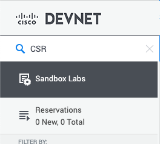
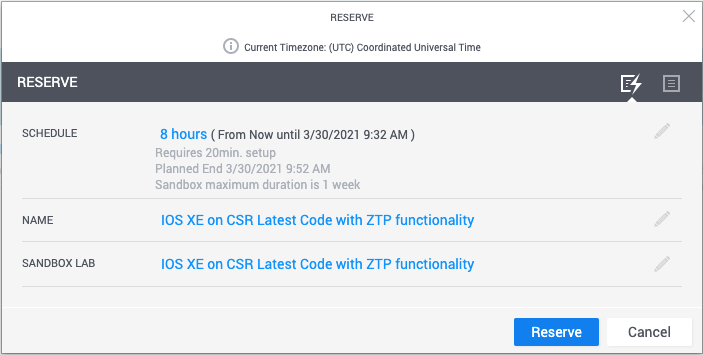
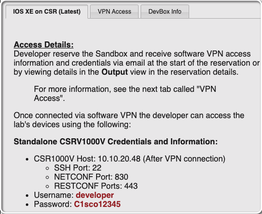

# Magic Carpet on a Cisco DevNet Sandbox

You can now run Magic Carpet against a CSR1000v in the Cisco DevNet Sandbox.  We have included a custom script and pre-configured testbed file for this purpose.

>To get started, sign up for a Cisco DevNet account at: https://devnetsandbox.cisco.com/RM/Topology

>Once you are signed in, search for "CSR" in the search dialog at the top left of the screen.



>Select one of the reserved instances - We recommend using the instance running the latest version of IOS-XE.


>Click "Reserve" after reviewing the reservation details.



You will receive an email from Cisco confirming the reservation along with links to download the Cisco AnyConnect VPN Client and instructions for its installation.

**Cisco AnyConnect VPN Client:**

https://developer.cisco.com/site/sandbox/anyconnect/

**Installation guide for Cisco AnyConnect VPN Client:**

https://devnetsandbox.cisco.com/Docs/VPN_Access/AnyConnect_Installation_Guide.pdf

>Click the "VPN Access" tab in the DevNet console and review the information in it.


**Note:** If this is your first time using the Cisco DevNet Sandbox, make sure to review the information in each of the tabs.

In about 15 to 20 minutes, you should receive another email from Cisco with the VPN credentials for your sandbox, including:

* VPN address and port for the connection
* VPN username
* VPN password

>Connect to the DevNet Sandbox VPN using the Cisco AnyConnect VPN Client


Once connected, you will have direct network access to the CSR1000v in DevNet.

The "IOS-XE on CSR" tab in the DevNet console will show you the details you need to connect to the device, however we have already added this information to the `testbed/testbed_DevNet_CSR1000v_Sandbox.yaml` file.

You can confirm it to be sure.



```yaml
devices:
    csr1000v-1:
      alias: 'DevNet_Sandbox_CSR1000v'
      type: 'router'
      os: 'iosxe'
      platform: csr1000
      credentials:
        default:
          username: developer
          password: C1sco12345
      connections:
        cli:
          protocol: ssh
          ip: 10.10.20.48
          arguments:
            connection_timeout: 360
```

You're now ready to run Magic Carpet against the DevNet CSR100v!

```console
pyats run job DevNet_Sandbox_CSR_magic_carpet_job.py --testbed-file testbed/testbed_DevNet_CSR1000v_Sandbox.yaml
```
